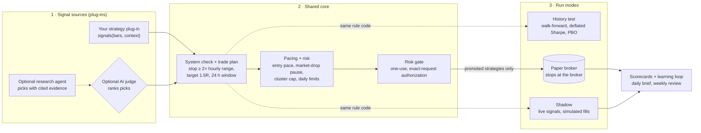

# Catalyst Lab

**Test trading strategies honestly, on paper.** Catalyst Lab is a crypto paper-trading lab
built around one idea: a strategy is a small plug-in, and every plug-in climbs the same
evidence ladder before it can touch even a paper account. History testing, live shadow
measurement, risk limits, sizing, execution and scorecards are shared; you write only the rule.

[](LICENSE)


> **Paper trading only.** There is no live-trading code path. The broker endpoints are fixed to
> Alpaca's paper environment in code, and a test fails if the live endpoint ever appears in the
> repository. Nothing here is investment advice.

## What it is

- **A strategy SDK.** A plug-in is one Python file: `signals(bars, context)` turns completed
  hourly bars into trade proposals. Decimal arithmetic, no I/O, no clock. Exits, fees,
  slippage and sizing come from the shared core, so a backtest, the shadow and paper trading
  run the same code.
- **An honest history tester.** Walk-forward out-of-sample testing, every declared variant
  counted as a trial, the deflated Sharpe ratio and the probability of backtest overfitting
  (PBO), net of fees and slippage on both legs.
- **A shadow runner.** Live signals on completed bars, fills simulated on 1-minute bars,
  recorded in an append-only, hash-chained ledger. No orders.
- **A paper engine.** A promoted strategy trades an Alpaca **paper** account behind a risk gate:
  every order needs a committed, unexpired, exact-request authorization that can be used once.
  Stops sit at the broker. Every decision is an audited event.
- **Optional AI.** The project also runs research agents and an AI judge (Jev, via TypeSafe) in
  its own reference deployment. You do not need either: `NO_AI_MODE_V1` runs mechanical
  plug-ins with code-only exits.

## The ladder (and why most ideas stop on rung 1)

1. **History test** — at least 30 walk-forward out-of-sample trades, positive mean net R with
   the lower end of its 90% interval above zero, deflated Sharpe ≥ 0.95, PBO ≤ 0.5.
2. **Shadow** — at least 30 simulated live trades with a positive mean net R.
3. **Paper** — only through a recorded promotion by the deployment's owner. Nothing promotes
   itself.

Be prepared for "no edge". The project's own breakout (`BREAKOUT_7D_VOL2X_V1`) failed rung 1
(−0.23 R per trade after costs, 271 trades), and its research found no reliable edge among 82
strategies fixed in advance and tested walk-forward on 2019–2026 crypto data with real fees. The included example plug-ins are **teaching examples, not
profitable strategies**. The ladder is the product.

## How it works



| Part | What it does |
| --- | --- |
| **Plug-ins** (`src/catalyst_lab/strategies/`, `examples/strategies/`) | A strategy declares its signals and plan rules. The same rule code runs in the history test, the shadow and paper trading. |
| **Shared core** (`strategies/core.py`, `trade_plan.py`, `regime_gate.py`) | Turns a proposal into a planned trade: volatility-scaled stop, 1.5R target, 24-hour window, entry pacing and a pause while the market is falling. |
| **Risk gate** (`account_risk.py`, `risk_*.py`, SQL) | Every POST, PATCH and DELETE to the broker needs a committed, unexpired, exact-request authorization used once. It caps risk per trade, open risk across correlated coins, risk per strategy, and has soft and hard daily loss limits. |
| **Ledger** (`audit.py`, migrations) | Every event goes into a hash-chained, append-only log; database triggers refuse UPDATE and DELETE. |
| **Learning loop** (`learning_jobs.py`, `daily_brief.py`, `weekly_learning.py`) | Nightly scorecards, what the market did and what was missed, prices after each exit, and a weekly review that proposes rule changes but never applies them. |
| **Public page** (`experiment_*.py`) | A read-only page with the account, equity and drawdown, daily P&L, R distribution, open positions and per-trade charts. |

## Quickstart (about 10 minutes)

You need Docker with Compose v2. No broker key, no AI key.

```
git clone <this repository> catalyst-lab && cd catalyst-lab
docker compose up --build
```

Then open http://127.0.0.1:8080 (the read-only page) and, in another terminal, run your first
history test on generated sample bars:

```
docker compose run --rm catalyst history-test --source synthetic \
    --plugins-dir /app/examples/strategies --strategy EXAMPLE_MA_CROSS_V1 \
    --start 2026-05-01 --end 2026-09-01 --is-days 30 --oos-days 15
```

Step by step, with what to expect: [docs/QUICKSTART.md](docs/QUICKSTART.md). Your first
strategy: [docs/FIRST-STRATEGY.md](docs/FIRST-STRATEGY.md). Every setting you choose:
[docs/CONFIGURATION.md](docs/CONFIGURATION.md). The SDK reference:
[docs/STRATEGY-PLUGINS.md](docs/STRATEGY-PLUGINS.md).

## Safety stance

- Paper only, enforced in code and by tests (`tests/test_safety.py`).
- Fail closed: a stale price, a lost stream, an unclean reconciliation or a missing setting
  blocks new entries; it never loosens a stop.
- History is never rewritten: corrections are appended; the ledger refuses UPDATE and DELETE.
- Rules change only as named versions (`NAME_V<n>`); a trade keeps the rules it was admitted
  under. The versions and their numbers are summarized in
  [docs/REFERENCE-RULES.md](docs/REFERENCE-RULES.md).
- Secrets never live in the repository or an image. The local stack generates its own database
  passwords; a broker key lives only in a `.env.paper` file you create.

## Repository map

| Path | What |
| --- | --- |
| `src/catalyst_lab/strategies/` | The strategy registry, the SDK (`sdk.py`) and the shared core |
| `examples/strategies/` | Teaching plug-ins: MA cross, Donchian breakout, RSI reversion |
| `src/catalyst_lab/history_test.py` | The history tester (walk-forward, deflated Sharpe, PBO) |
| `src/catalyst_lab/strategy_shadow.py` | The shadow runner |
| `src/catalyst_lab/managed_*.py`, `risk_*.py` | The paper engine and the risk gate |
| `src/catalyst_lab/local_stack.py`, `compose.yaml` | The one-command local stack |
| `src/catalyst_lab/migrations/` | Numbered schema migrations |
| `research_agent/` | The optional research-agent kit (the reference deployment's AI loop) |
| `docs/` | Guides and reference |

## Contributing and security

See [CONTRIBUTING.md](CONTRIBUTING.md) and [SECURITY.md](SECURITY.md). Licensed under the
[MIT License](LICENSE); the bundled IBM Plex fonts are under the SIL Open Font License 1.1.

## Who built it

The project is directed by its owner. The code was written by AI engineers: OpenAI Codex
through 2026-09-20, then Anthropic's Claude (Claude Code). The optional judge model is
TypeSafe's Jev.

