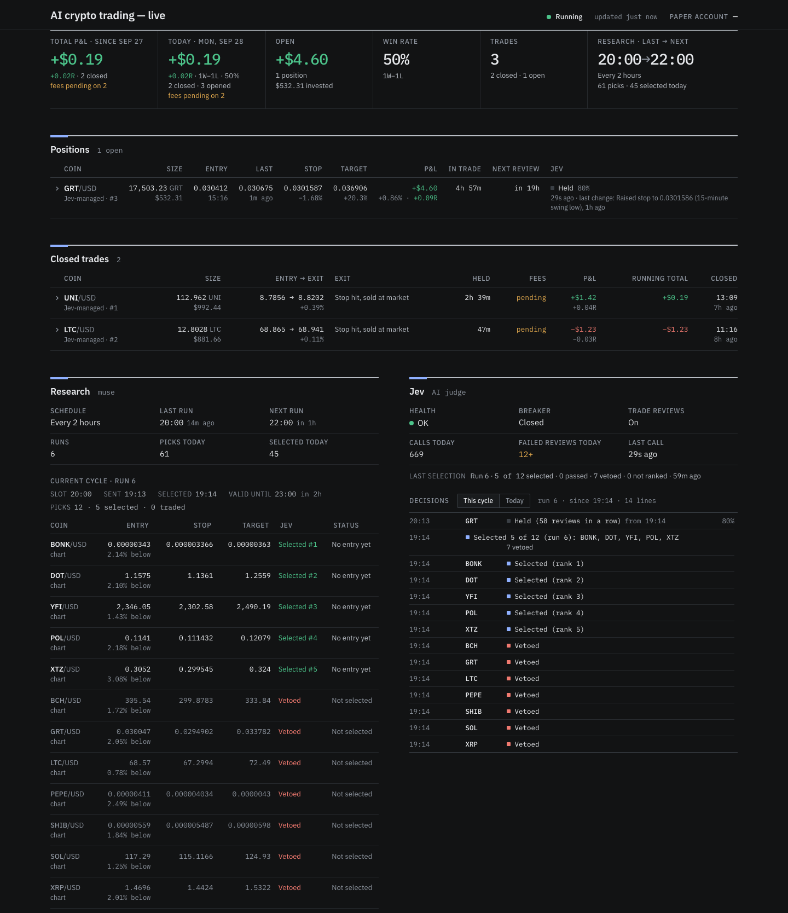
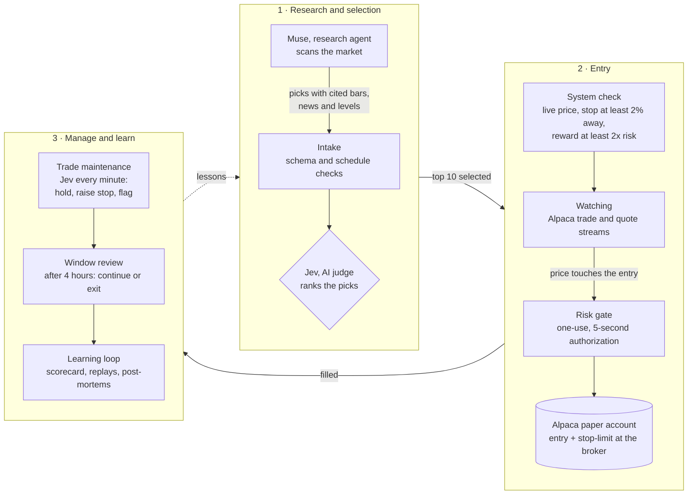
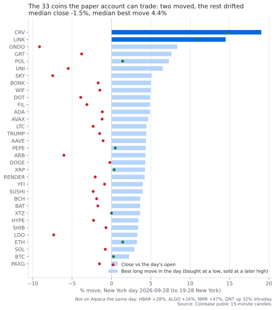
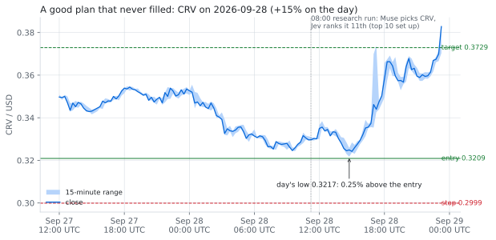
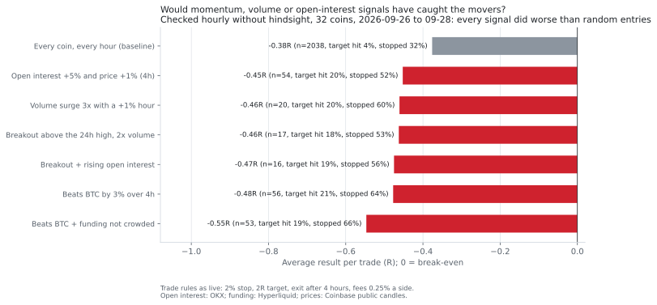
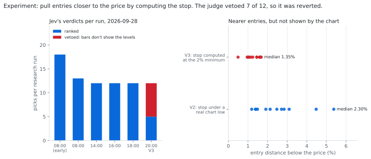

# Catalyst Retest Lab

**An AI crypto trading desk, run on paper.** A research agent (Muse) proposes trade setups
backed by cited evidence. An AI judge (Jev) ranks them and manages each open trade minute by
minute. A risk-gated engine executes them on an Alpaca **paper** account, behind stops that sit
at the broker. Every decision is written to a tamper-evident ledger, and a learning loop grades
the outcomes.

[](LICENSE)




<sub>The public dashboard on the first live day, 2026-09-28. It shows one open position (GRT),
two closed trades, the current research cycle and every decision Jev made. All figures are
paper money.</sub>

> **Paper trading only.** There is no live-order code path, and a test fails if the live
> endpoint ever appears in the repository. Nothing here is investment advice.

## Contents

- [How it works](#how-it-works)
- [Design rules](#design-rules)
- [What we have learned](#what-we-have-learned)
  - [The scoreboard](#the-scoreboard)
  - [First live day in the cloud](#1-first-live-day-in-the-cloud-2026-09-28)
  - [Did we miss the movers?](#2-did-we-miss-the-movers)
  - [Experiment: computed stops](#3-experiment-computed-stops-for-nearer-entries)
  - [Earlier studies](#4-earlier-studies)
- [What's next](#whats-next)
- [Running it](#running-it)
- [Repository map](#repository-map)
- [Who built it](#who-built-it)

## How it works



| Part | What it does |
| --- | --- |
| **Muse** (`research_agent/`) | Scans the market on public Coinbase candles and news. It writes each pick with the exact bars and sources behind it, and sends the picks to the app over a token-scoped API. It can create and read candidates, but it can never set size or trigger execution. |
| **Jev** (`src/catalyst_lab/jev_*`, `research_selection_topk.py`, `trade_maintenance.py`) | TypeSafe's judgment model (pinned `jev-1.13.0`), called only from inside the app. It answers fixed question sets about each pick, such as whether the bars show the levels and whether the news is stale. Jev never sees which agent made a pick. |
| **Engine** (`managed_runtime.py`, `managed_execution.py`, `crypto_*.py`) | Watches the live Alpaca streams, fires entries on a mechanical touch rule and places native stop-limit orders. Protection keeps running even when the AI is slow or down. |
| **Risk gate** (`risk_*.py`, SQL) | Every POST, PATCH and DELETE to the broker needs a committed, unexpired, exact-request authorization that can be used once. The gate also caps risk per trade, total risk and trades per sector. |
| **Ledger** (`audit.py`, migrations) | Every event goes into a hash-chained, append-only log, and database triggers refuse UPDATE and DELETE on it. |
| **Ops, jobs and dashboard** | A watchdog raises alarms. Daily jobs back up the ledger and run the learning loop. A public read-only page shows live figures. |

## Design rules

- **Paper only.** The live-trading endpoint is banned from the codebase by a test.
- **Fail closed.** Stale prints, a lost stream, an unclean reconciliation or a slow judge block
  new entries. They never loosen a stop.
- **The broker holds the stop.** Stops are native stop-limit orders at Alpaca. If the bid falls
  through a stop that has not filled, the app sells at market.
- **Rules change only as named versions.** An example is `STALE_PRINT_ABOVE_TRIGGER_V1`. Each
  version is recorded in [CONTRACT-RESOLUTIONS](docs/CONTRACT-RESOLUTIONS.md) with its reason,
  never edited in place. A setup keeps the rules it was admitted under.
- **History is never rewritten.** Corrections are appended as new events. Numbered migrations
  change the schema, and application credentials never own tables.
- **Honest measurement.** Fees are read from the broker. Results are counted in R, the multiple
  of the risk taken on each trade. Engineering test trades are kept out of strategy results.

## What we have learned

### The scoreboard

Every serious test so far says **no edge yet**. That is why the project is currently using
paper volume to harden the engine rather than tuning a strategy.

| Test | Sample | Result |
| --- | --- | --- |
| Catalyst-retest rule, crypto daily bars, 2024–2026 | 49 trades (main setting), 9 settings | Mean **−0.36R**, 18.4% wins; negative in all 9 settings |
| Strategy search, 22 crypto pairs | 1,024 rule combinations and 4 rule families | 3 passed the in-sample screen, none held up out of sample; **holding BTC beat every rule** |
| US earnings event study (EDGAR 8-Ks) | 19,010 events, 1,109 stocks | Retest rule **−0.46R** (959 trades). A hedged post-earnings short made +0.94% (t 2.9) but missed the pre-set bar |
| Cash merger arbitrage | 587 deals, 2019–2026 | **−0.1% per deal** at the median spread; worth it only at the upper quartile |
| Jev vs a blind independent labeller | 60 synthetic cases | Holdout agreement **84.6%** (22/26), development 96.3% |
| First managed paper trade (BTC) | 1 trade | The stop-limit did not fill, so the app sold at market: about **−1.48R** after fees |
| First live cloud day | 3 trades | UNI and LTC closed near break-even; GRT still open |
| Momentum and open-interest signals (no hindsight) | 32 coins × 2.5 days | Every signal averaged **−0.45R to −0.55R**, worse than random entries (−0.38R) |

### 1. First live day in the cloud (2026-09-28)

This was the first full day on Railway, with research, Jev, the engine, the watchdog and the
dashboard all running. It produced six research runs, 61 picks and 45 selected by Jev, which
led to three trades:

| Coin | Entry | Exit | Result |
| --- | --- | --- | --- |
| LTC | 68.865 | 68.941 | Jev raised the stop from 65.24 to 68.68 within 31 minutes. The bid touched it, and the app's fallback sold at market near break-even. |
| UNI | 8.7856 | 8.8202 | Jev trailed the stop three times, twice to near the entry. It closed the same way, near break-even. |
| GRT | 0.030412 | still open | Jev raised the stop twice to a recent 15-minute low. Each raise was one amendment at Alpaca, followed by a clean reconciliation. |

Running it for real found defects the tests had not. Each fix is a named version or a tested
change:

- **A late price print cancelled valid setups.** Alpaca's crypto trades arrived 3–5 s late, and
  the app treated a stale print *above* the entry as a feed failure. Fixed as
  `STALE_PRINT_ABOVE_TRIGGER_V1`.
- **The engine checked prices 1–3 s late.** It opened a new TLS database connection for every
  query. Reusing connections, and waking the loop on each print, cut the cycle from **2.65 s to
  1.30 s**.
- **The judge timed out.** 20% of Jev's trade reviews hit a 3-second limit during provider
  stalls. Fixed with one retry, then `JEV_LIVE_REVIEW_POLICY_V2` (8 s), shipped through the
  first guarded cloud migration with a verified backup.
- **A stop replacement cancelled its own new stop.** The order being replaced was counted twice
  as a sell reservation, which left UNI unprotected for about 6 s. Fixed the same day.
- **The logs were too big.** A heartbeat every 5 s and a fee check every 30 s were each
  cut to "on change" plus a slow refresh.

### 2. Did we miss the movers?

The day felt dead, so we asked: *did better research techniques miss winning trades?*



- **Only two tradable coins really moved: CRV (+15%) and LINK (+11%).** The median coin closed
  down 1.5%. On a risk-off day (oil above $100, US 10-year yields at their highest since 2007),
  91 of CoinDesk's top 100 coins were down. The biggest movers (HBAR, ALGO, NMR, QNT) are not
  tradable on Alpaca at all.
- **LINK was skipped by design.** It rose without a pullback, and the research only buys
  pullbacks to support whose stop and target the chart shows.
- **CRV was found and then lost at two gates.** Muse picked it in the morning with a plan that
  would have worked. Jev ranked it 11th, one place below the top-10 cut. On top of that, the
  day's low stopped 0.25% above the entry.



Would momentum, volume, open-interest or funding signals have caught them? We tested each one
without hindsight: at every hour, a signal saw only the data available up to that hour. Each
signal then took the live trade rules, a 2% stop, a 2R target and a 4-hour exit.



- **None of these signals fired before a move.** Ahead of LINK and CRV, open interest was flat
  or falling and funding sat at its floor. The signals fired only after the moves were
  underway, when LINK was up 6% and CRV up 5%.
- **Chasing lost money.** Every signal did worse than buying at random, because breakouts on
  these coins pull back more than 2% and hit the stop.
- **News came early but not on time.** LINK, HBAR and QNT had public news days ahead
  (partnerships, the Sibos banking conference, ETF inflows), but none of it said *when*. CRV,
  ALGO and NMR had no news at all.
- **The caveat:** 2.5 quiet days is a small sample. The right tool for judging these ideas is a
  history tester run on years of data, which is next on the build plan.

### 3. Experiment: computed stops for nearer entries

Entries sat 2–4% below the price, so few filled. We tried a research profile (`INTRADAY_V3`)
that set the stop at exactly the 2% minimum instead of under a real chart low. On test data it
doubled the coins with a valid setup, from 12 to 26 of 33, and put every pick within 1.5% of the
price (8 of 12 in its one live run).



Jev vetoed 7 of the 12, all of them floored picks, with the verdict "the bars don't show these
levels". It had vetoed nothing in the five earlier runs that day. That is the judge working as
intended: a stop that no chart shows is not supported by the evidence. We reverted within the
hour and kept the finding, which is that bar-anchored stops at least 2% away with a 2R target
make near entries rare on intraday charts.

### 4. Earlier studies

- **Catalyst-retest backtest** (2026-09-25). The rule buys the retest of the pre-announcement
  high after a catalyst day of at least 12% on at least 2x volume, with the stop at that day's
  low.
  - Data: Alpaca daily bars for 20 crypto pairs, 2024–2026, with fees.
  - Result: 49 trades, 18.4% wins, mean −0.36R. It was negative in all nine
    threshold settings, and 27 of the 49 trades hit their stop on the retest day itself.
- **Strategy search** (2026-09-25).
  - Method: 1,024 entry, stop and exit combinations, plus trend, dip, flag and momentum rule
    families, with separate in-sample and out-of-sample periods, a block bootstrap and a
    random-entry benchmark.
  - Result: 3 combinations passed the screen, with out-of-sample t-stats of 0.92, 0.54 and
    0.02. A look-ahead bug had first made 23 look robust (t up to 5.1); catching it was the
    most useful outcome.
- **Earnings event study** (2026-09-25).
  - Data: 19,010 timestamped earnings releases from EDGAR.
  - Results: the retest rule lost (−0.46R, t −8.2). A large up-reaction drifted +1.75%, but only
    +0.30% after subtracting the S&P 500 (SPY)'s move. A hedged short after bad reactions made
    +0.94%, but missed the bar set before the test.
- **Merger arbitrage** (2026-09-25).
  - Data: 587 cash deals; 96% completed, a median 84 days to close.
  - Result: at the median spread, the roughly 35% loss on a broken deal cancels the yield
    (−0.1% per deal).
- **Validating the judge** (2026-09-20 to 09-28).
  - 60 synthetic cases, labelled blind by an independent AI: 84.6% agreement on the holdout.
  - One question was answered "yes" 0.88–0.99 of the time whatever the input, so it was split.
  - The "news is stale" question flipped on an identical rerun, so it was reworded and made a
    veto only at a probability of 0.70 or more.
  - Contradictory trade-management answers once sold a trade that both sides wanted to keep.
    That led to stricter answer rules (V2), after which 62 of 62 calls were valid.

The raw evidence (captured pages, provider responses, ledger exports) stays private. The write-ups
are in [docs/PHASES.md](docs/PHASES.md), [docs/NEXT-BUILD-PLAN.md](docs/NEXT-BUILD-PLAN.md) and the
dated documents in [docs/](docs).

## What's next

- **Research loop V2** (in progress, [design](docs/RESEARCH-LOOP-V2.md)): a deep daily run at
  08:00 whose picks live 24 hours, plus 2-hourly updates. The updates adjust unfilled setups,
  withdraw stale ones and add new coins, and Jev reviews only what changed.
- **History tester:** tests an idea on years of minute bars in minutes, instead of waiting
  weeks for live samples.
- Then, in order:
  - maker entry orders, to cut fees from 0.25% to 0.15% a side;
  - a cap on total Bitcoin exposure;
  - event-driven research;
  - richer data, cited as evidence first;
  - a rules-only shadow baseline;
  - a simulated second venue on real order books.

## Running it

**Requirements:** macOS or Linux, Python 3.12+, [uv](https://docs.astral.sh/uv/), and PostgreSQL
16 binaries (`initdb` and `pg_ctl`) on your `PATH`. On a Mac, `./setup-mac.sh` installs them.

```bash
./setup-mac.sh
```

The test suite builds disposable local PostgreSQL clusters. It never touches a real broker, a
real model provider or a real ledger.

```bash
./run pytest -q
```

Lint:

```bash
./run ruff check src tests research_agent
```

The research kit is Muse's toolbox. It works against a running app (base URL and agent token
file); the example below writes into a local run folder:

```bash
./run python -m research_agent.run all --profile intraday --base-url https://your-app.example --token-file ~/.config/muse-token --run-dir runs/today --agent-id muse --agent-version my-muse-v1 --max-picks 12
```

`all` builds and validates the report, and `submit` sends it.

- **Configuration:** environment variables only (see [.env.example](.env.example) and
  [deploy/private-paper.example.json](deploy/private-paper.example.json)). Credentials are
  never read from files in production.
- **Deployment:** Railway (trader, ops, jobs, dashboard, Postgres), described in
  [docs/RAILWAY-DEPLOYMENT.md](docs/RAILWAY-DEPLOYMENT.md). Muse's API is described in
  [docs/MUSE-CONNECTION.md](docs/MUSE-CONNECTION.md).

## Repository map

| Path | Contents |
| --- | --- |
| `src/catalyst_lab/` | The engine: FastAPI app, managed runtime, execution, risk gate, Jev integration, trade maintenance, learning loop, dashboards, SQL migrations |
| `research_agent/` | The research kit (Muse): market data, level rules, report builder, outlook and post-mortems |
| `tests/` | 4,500+ tests on disposable PostgreSQL |
| `docs/` | Design, the rulebook of named versions ([CONTRACT-RESOLUTIONS](docs/CONTRACT-RESOLUTIONS.md)), the build log ([PHASES](docs/PHASES.md)), runbooks and studies |
| `scripts/`, `deploy/` | Operational scripts, release packaging and the example deployment config |

## Who built it

The project is directed by its owner. The code was written by AI engineers: OpenAI Codex
through 2026-09-20, then Anthropic's Claude (Claude Code), which also runs the live experiment.
Jev is TypeSafe's judgment model. Muse is the external research role.

## License

[MIT](LICENSE). The IBM Plex fonts in `src/catalyst_lab/static/fonts/` are under the SIL Open
Font License 1.1 ([OFL.txt](src/catalyst_lab/static/fonts/OFL.txt)).
