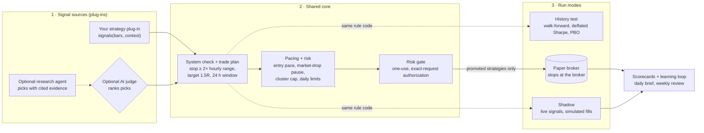
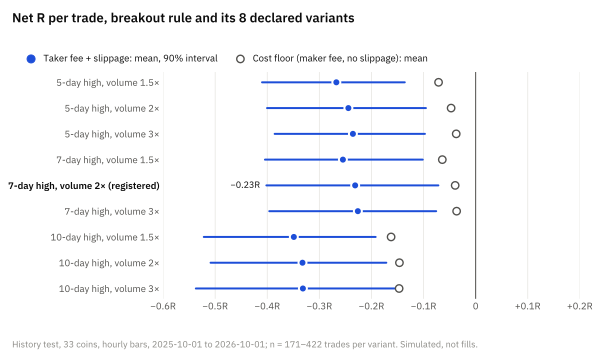
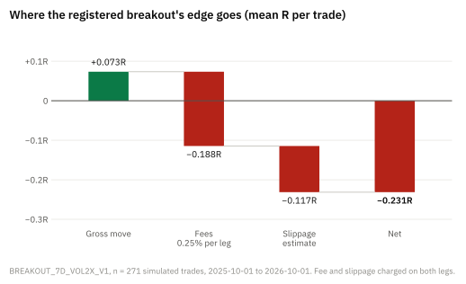
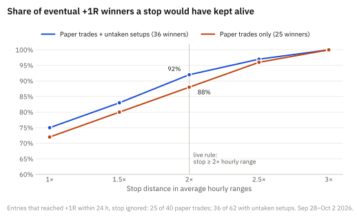
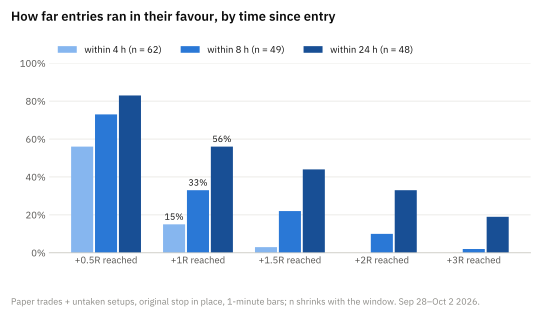
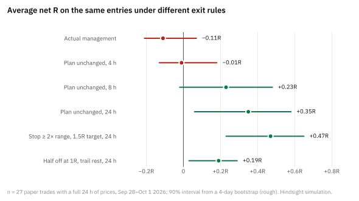
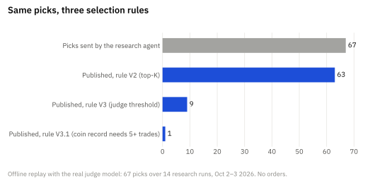
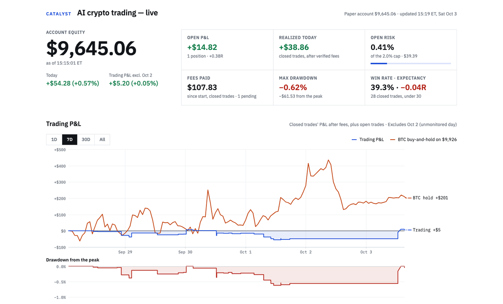

# Catalyst Lab

**Test trading strategies honestly, on paper.** Catalyst Lab is a crypto paper-trading lab
built around one idea: a strategy is a small plug-in, and every plug-in climbs the same
evidence ladder before it can touch even a paper account. History testing, live shadow
measurement, risk limits, sizing, execution and scorecards are shared; you write only the rule.

[](LICENSE)


> **Paper trading only.** There is no live-trading code path. The broker endpoints are fixed to
> Alpaca's paper environment in code, and a test fails if the live endpoint ever appears in the
> repository. Nothing here is investment advice.

## What it is

- **A strategy SDK.** A plug-in is one Python file: `signals(bars, context)` turns completed
  hourly bars into trade proposals. Decimal arithmetic, no I/O, no clock. Exits, fees,
  slippage and sizing come from the shared core, so a backtest, the shadow and paper trading
  run the same code.
- **An honest history tester.** Walk-forward out-of-sample testing, every declared variant
  counted as a trial, the deflated Sharpe ratio and the probability of backtest overfitting
  (PBO), net of fees and slippage on both legs.
- **A shadow runner.** Live signals on completed bars, fills simulated on 1-minute bars,
  recorded in an append-only, hash-chained ledger. No orders.
- **A paper engine.** A promoted strategy trades an Alpaca **paper** account behind a risk gate:
  every order needs a committed, unexpired, exact-request authorization that can be used once.
  Stops sit at the broker. Every decision is an audited event.
- **Optional AI.** The project also runs research agents and an AI judge (Jev, via TypeSafe) in
  its own reference deployment. You do not need either: `NO_AI_MODE_V1` runs mechanical
  plug-ins with code-only exits.

## The ladder (and why most ideas stop on rung 1)

1. **History test** — at least 30 walk-forward out-of-sample trades, positive mean net R with
   the lower end of its 90% interval above zero, deflated Sharpe ≥ 0.95, PBO ≤ 0.5.
2. **Shadow** — at least 30 simulated live trades with a positive mean net R.
3. **Paper** — only through a recorded promotion by the deployment's owner. Nothing promotes
   itself.

Be prepared for "no edge". The project's own breakout (`BREAKOUT_7D_VOL2X_V1`) failed rung 1
(−0.23 R per trade after costs, 271 trades), and its research found no reliable edge among 82
strategies fixed in advance and tested walk-forward on 2019–2026 crypto data with real fees. The included example plug-ins are **teaching examples, not
profitable strategies**. The ladder is the product.

## How it works



| Part | What it does |
| --- | --- |
| **Plug-ins** (`src/catalyst_lab/strategies/`, `examples/strategies/`) | A strategy declares its signals and plan rules. The same rule code runs in the history test, the shadow and paper trading. |
| **Shared core** (`strategies/core.py`, `trade_plan.py`, `regime_gate.py`) | Turns a proposal into a planned trade: volatility-scaled stop, 1.5R target, 24-hour window, entry pacing and a pause while the market is falling. |
| **Risk gate** (`account_risk.py`, `risk_*.py`, SQL) | Every POST, PATCH and DELETE to the broker needs a committed, unexpired, exact-request authorization used once. It caps risk per trade, open risk across correlated coins, risk per strategy, and has soft and hard daily loss limits. |
| **Ledger** (`audit.py`, migrations) | Every event goes into a hash-chained, append-only log; database triggers refuse UPDATE and DELETE. |
| **Learning loop** (`learning_jobs.py`, `daily_brief.py`, `weekly_learning.py`) | Nightly scorecards, what the market did and what was missed, prices after each exit, and a weekly review that proposes rule changes but never applies them. |
| **Public page** (`experiment_*.py`) | A read-only page with the account, equity and drawdown, daily P&L, R distribution, open positions and per-trade charts. |

## Research findings

The project tests its own ideas the same way it asks you to test yours. Most of them failed, and
that is why the ladder exists. Every chart below is drawn from a study's own output files by
[`scripts/readme_charts.py`](scripts/readme_charts.py). They are simulations, replays or small
samples from a single market phase (2025–2026 crypto). None of them proves an edge.

### 1. Does a simple breakout survive trading costs?

**Method.** A walk-forward history test of `BREAKOUT_7D_VOL2X_V1` (an hourly close above the
7-day high on twice the usual volume) and its 8 variants, all declared in advance, on 33 coins
from October 2025 to October 2026. Fees are 0.25% a side and slippage is modelled on both legs.



**Finding.** Every variant loses after costs. For each one, the whole 90% interval sits below
zero. The registered rule makes −0.23R per trade over 271 trades. Out of sample it makes −0.26R
over 243 trades, with a deflated Sharpe ratio of 0.007. Two cheaper cost settings do not save it.
At a maker-fee floor with no slippage, every mean is still negative (−0.04R for the registered
rule). On Coinbase prices the means are negative too, from −0.00R to −0.23R, although the
intervals of the 3× volume variants cross zero there.



The breakout has a small gross edge of +0.07R per trade, and fees alone take 0.19R. With the
stop about 2.5–3% below entry, the two 0.25% fees come to roughly a fifth of 1R.

**What the project did.** The rule failed rung 1, so it stays a shadow strategy and is not
promoted.

### 2. How wide does a stop need to be?

**Method.** The study took every paper entry and untaken setup that went on to reach +1R within
24 hours. On Coinbase 1-minute bars it measured how far each one fell first, in units of the
coin's average hourly range.



**Finding.** The original stops sat a median 1.75 hourly ranges away, and they stopped out
trades that later worked. A stop 1.5× the hourly range would have kept 80–83% of these winners.
At 2× it keeps 88–92%, and at 2.5× it keeps 96–97%. This rests on 25 winners (36 with the
untaken setups) over five days, so treat it as a consistent pattern, not an established fact.

**What the project did.** It made this the live rule: a stop at least 2× the hourly range
(`CRYPTO_TRADE_PLAN_V1`). The dollar risk stays the same, so the position gets smaller.

### 3. How long do moves take?

**Method.** On the same entries, the study measured the share that reached +0.5R through +3R
within 4, 8 and 24 hours of entry, with the original stop in place.



**Finding.** Within 4 hours only 15% reached +1R. That rises to 33% within 8 hours and 56% within
24 hours. The original targets, a median 3.2R away, were reached by 6% within 24 hours.

**What the project did.** It replaced the 4-hour window with a 24-hour one and capped the target
at 1.5R.

### 4. Which exit rule, on the same entries?

**Method.** The study replayed 27 paper trades that have a full 24 hours of prices under
different exit rules. Each simulation used 1-minute bars, fees, and stop slippage of 0.3%.



**Finding.** Leaving the plan alone beat how the trades were actually managed. Actual management
made −0.11R per trade. Holding the plan unchanged made −0.01R at 4 hours, +0.23R at 8 hours and
+0.35R at 24 hours. A 2× range stop with a 1.5R target held 24 hours made +0.47R. Taking half off
at 1R did worse, at +0.19R. Be careful with these numbers: this is hindsight on four days, the
intervals come from a bootstrap over only four days, and the rules were compared after the data
was seen. The positive values are not an edge.

**What the project did.** The live plan is the combination that did best: a stop at least 2×
the range, a 1.5R target and a 24-hour window. It is now measured forward like any other
rule. Stop-raising changed as well (`CRYPTO_MAINTENANCE_V4`): no raise before +1R, and never
within 2 hourly ranges of the bid.

### 5. Does an AI judge pick better trades?

**Method.** The study took 67 research picks from 14 runs and replayed them offline through
the real judge model. It applied two stricter selection rules (`JEV_TOP_K_SELECTION_V3` and
V3.1) and compared their choices with the picks' simulated 24-hour outcomes.



**Finding.** V3's choices mostly followed each coin's last one or two trades. V3.1 removed that
line, and then the judge's probability bunched between 0.23 and 0.66. It did not predict
outcomes. Against the 24-hour simulated result its Spearman correlation was −0.27 (n = 27).
Against real trades it was −0.10 (n = 13). The samples are tiny and include a sell-off day.

**What the project did.** It kept both rules off. The simpler top-K rule (V2) stays in place. No
threshold for the judge will be set until it has a record of 40 or more outcomes.

### 6. Earlier, broader studies (summary)

- **82 strategies, 2019–2026.** Every strategy was fixed in advance and tested walk-forward with
  real fees. None was reliable. The best was holding BTC and ETH only while they trade above
  their 50-day average, which mostly amounts to holding less crypto. Even that drew down about
  50%.
- **Big movers.** Signals built on a coin's large moves predicted its later volatility, not its
  direction. Buying the crash lost money. The only signal that came out positive in both test
  periods was the 7-day breakout on volume, and it fell to about zero at Coinbase fees. Its full
  test is in finding 1.

### The public page

The read-only page shows the paper account's equity against a BTC buy-and-hold line, the
drawdown, open risk, fees and the R distribution.



*Paper account. Simulated money at Alpaca's paper broker.*

## Quickstart (about 10 minutes)

You need Docker with Compose v2. No broker key, no AI key.

```
git clone <this repository> catalyst-lab && cd catalyst-lab
docker compose up --build
```

Then open http://127.0.0.1:8080 (the read-only page) and, in another terminal, run your first
history test on generated sample bars:

```
docker compose run --rm catalyst history-test --source synthetic \
    --plugins-dir /app/examples/strategies --strategy EXAMPLE_MA_CROSS_V1 \
    --start 2026-05-01 --end 2026-09-01 --is-days 30 --oos-days 15
```

Step by step, with what to expect: [docs/QUICKSTART.md](docs/QUICKSTART.md). Your first
strategy: [docs/FIRST-STRATEGY.md](docs/FIRST-STRATEGY.md). Every setting you choose:
[docs/CONFIGURATION.md](docs/CONFIGURATION.md). The SDK reference:
[docs/STRATEGY-PLUGINS.md](docs/STRATEGY-PLUGINS.md).

## Safety stance

- Paper only, enforced in code and by tests (`tests/test_safety.py`).
- Fail closed: a stale price, a lost stream, an unclean reconciliation or a missing setting
  blocks new entries; it never loosens a stop.
- History is never rewritten: corrections are appended; the ledger refuses UPDATE and DELETE.
- Rules change only as named versions (`NAME_V<n>`); a trade keeps the rules it was admitted
  under. The versions and their numbers are summarized in
  [docs/REFERENCE-RULES.md](docs/REFERENCE-RULES.md).
- Secrets never live in the repository or an image. The local stack generates its own database
  passwords; a broker key lives only in a `.env.paper` file you create.

## Repository map

| Path | What |
| --- | --- |
| `src/catalyst_lab/strategies/` | The strategy registry, the SDK (`sdk.py`) and the shared core |
| `examples/strategies/` | Teaching plug-ins: MA cross, Donchian breakout, RSI reversion |
| `src/catalyst_lab/history_test.py` | The history tester (walk-forward, deflated Sharpe, PBO) |
| `src/catalyst_lab/strategy_shadow.py` | The shadow runner |
| `src/catalyst_lab/managed_*.py`, `risk_*.py` | The paper engine and the risk gate |
| `src/catalyst_lab/local_stack.py`, `compose.yaml` | The one-command local stack |
| `src/catalyst_lab/migrations/` | Numbered schema migrations |
| `scripts/readme_charts.py` | Redraws the research charts in `docs/images/` from a study's output files |
| `research_agent/` | The optional research-agent kit (the reference deployment's AI loop) |
| `docs/` | Guides and reference |

## Contributing and security

See [CONTRIBUTING.md](CONTRIBUTING.md) and [SECURITY.md](SECURITY.md). Licensed under the
[MIT License](LICENSE); the bundled IBM Plex fonts are under the SIL Open Font License 1.1.

## Who built it

The project is directed by its owner. The code was written by AI engineers: OpenAI Codex
through 2026-09-20, then Anthropic's Claude (Claude Code). The optional judge model is
TypeSafe's Jev.

