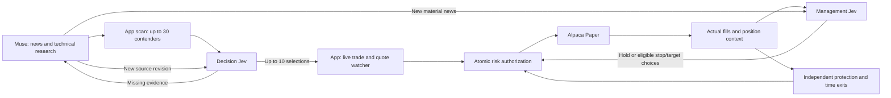

# Muse → decision Jev → paper execution → management Jev

**PAPER TRADING — SIMULATED. Not real money.**

Owner direction: finish the stock/crypto integration, with Codex acting as Muse for supervised local sessions. India remains research-only. This implementation is opt-in and separately labeled; the frozen US `CATALYST_RETEST_V1` baseline and its history are preserved. The old Step 4 store-only boundary is superseded for this explicitly enabled engineering workflow.

## What now connects

Muse supplies retained original-source excerpts, thesis, disproof and economic connection. The application computes technical features and executable geometry from provider data. The two Jev roles use the same pinned `jev-1.13.0` through one adapter, with separate versioned question sets, receipts and position contexts. They are not two autonomous agents with their own data feeds.

A cycle aims for 20–30 researched contenders and 5–10 selections. These are capacity targets, not approval quotas. Insufficient qualifying evidence can produce fewer selections. Ten selected setups never mean ten simultaneous positions: each working/open position reserves a 1% budget, combined exposure cannot exceed 2%, and the named test classification policy treats all crypto as one shared sector/theme budget.

### Research and evidence

The named `MUSE_TECH_NEWS_SCAN_ENGINEERING_V1` research profile uses 60 completed one-minute bars, 5/20-bar moving averages, 14-bar ATR, observed pivots and resistance, five-bar relative volume, current spread and source-backed news. Technical arithmetic is deterministic. The first nearby observed resistance must support 2R at M; the scan cannot invent a farther target to force acceptance. Raw screened assets, exclusions, missing inputs, source hashes and selection outcomes are retained.

The approved SKEPTIC conjunction is unchanged: verdict APPROVE, news_stale NO, unsupported_inference NO, already_priced LOW or MEDIUM. REJECT is excluded; contradictory, insufficient or unavailable answers become NEEDS_REVIEW. Muse receives specific evidence tasks. Only genuinely new source content creates another revision; changing an ID or repeating the same packet cannot create a favorable reroll. There is no two-cycle rework cap, confidence cutoff or forced minimum number of picks.

Position news has its own lifecycle-bound immutable intake, so a new announcement can be reviewed after the original research cycle expires. It cannot rewrite the original thesis, extend the holding deadline, submit orders or change quantity. New material evidence makes an in-flight older management context obsolete.

### Entry, account risk and continuous monitoring

US execution uses the frozen touch trigger and whole-share DAY bracket: S < T ≤ M < P; regular-session print ≤ T; fresh ask ≤ M; spread ≤10bps; quote and executable print ≤5 seconds old; healthy subscribed feed; no stop touch first. Entry limit is M and admission reward/risk is computed at M. The print itself must occur in the regular session. Calendar close minus five minutes governs normal and early-close exits. US eligibility also requires the active tradable equity, 20 completed exchange sessions of daily liquidity, and the existing $20M average dollar-volume test profile.

Crypto has a separately named test strategy, `CRYPTO_STRUCTURAL_RETEST_TEST_V1`: analogous observed structural levels and freshness/risk checks, 24/7 entry availability, broker precision/minimum-size rules and a maximum 24-hour holding deadline. It is not attributed to the US strategy. The documented broker limitations require a native GTC stop-limit plus application-managed target and cancellation/reconciliation recovery; crypto brackets or OCO support are not assumed. Native stop-limit orders can gap without filling, so local protection recovery remains necessary. See [CRYPTO-EXECUTION-CONTRACT.md](CRYPTO-EXECUTION-CONTRACT.md).

Real trade/quote websocket subscriptions are the entry authority. Received WATCHING prints are written to a durable queue before processing; a later quote cannot erase an earlier stop touch. Disconnect, overflow, out-of-order input, stale processing or restart invalidates affected waiting setups. Reconnection and clean broker reconciliation precede any new entry. REST polling is used for research and reconciliation, not as a substitute for a continuous trigger stream.

Every broker POST, DELETE and PATCH needs an exact, committed, unexpired, one-use risk decision. Sizing uses current broker equity and M−S, never Muse quantity. The legacy and new engines share the same database lock, working/open risk budget and correlation checks. A durable −3% account halt cancels and flattens. US ticker/day attempt ownership is shared across engines; crypto cannot have two active setups for the same symbol. Unknown submission status is reconciled using the original client order ID before anything else.

The execution/protection, trade updates, stock stream, crypto stream, reconciliation, heartbeat and research/management workers run independently. Research and position Jev calls run concurrently. Jev being slow or unavailable cannot postpone a stop, target, risk halt or mandatory exit. A restart reloads durable work and consumes a recorded, still-current model response rather than obtaining a second vote.

### Management choices and analysis

`JEV_MANAGED_EXITS_V1` offers HOLD, TIGHTEN_STOP, EXTEND_TARGET or TIGHTEN_AND_EXTEND. The application derives eligible price IDs from completed-bar lows/highs and venue tick size; Jev selects IDs rather than calculating new prices. Missing or contradictory judgments make no change. Stops cannot widen, targets cannot move inward, quantity cannot increase, and no model decision can postpone the hard exit. Refuted-thesis output is an alert; arbitrary model-requested market exits remain disabled.

A valid judgment is bound to the original thesis, actual fill/inventory, acknowledged protection, position lifecycle/revision, news revision and deadline. The controller reloads broker state and price before beginning an amendment. Expired, unstarted changes are discarded; a replacement already in progress completes through mechanical protection recovery. Parent partial fills, missing children, late fills and replacement IDs have dedicated regression coverage. A zero-exposure claim requires no broker position, no working owned order and no active local reservation.

Independent measurement samples the first valid received observation per second while actual broker inventory is open, without waiting for Jev. It retains trade/quote timestamps, provider/feed, spread and available volume. Results derive gross closed-lifecycle P&L from fills and test R from the original reserved planned risk. Observed MFE/MAE are explicitly sampled excursions, not tick extrema; coverage gaps and IEX limitations are visible. Missing observations and unverified crypto fees/net P&L remain null. This test-R convention does not rewrite the frozen baseline's historical R definition.

Unexpected shorts trigger a durable operator-reconciliation halt and cancellation of owned residual orders. The long-only controller does not invent a buy-to-cover policy, declare the position flat, release its reservation or automatically resume after restart. This is a supervised failure path, not proof that a venue reversal has been recovered.

The cohort is **`JEV_MANAGED_PAPER_V1`** throughout managed records, results and the private lab page. `CATALYST_RETEST_V1` baseline and `JEV_US_SELECTED_FIXED_TEST_V1` remain separate. The new page is private and supervised, so it does not disclose live picks through the public historical dashboard.

## Files

| Files | Responsibility |
|---|---|
| `setup_scan.py`, `scan_sources.py` | Deterministic technical/news scan, GET-only provider adapter, data provenance |
| `research_cycle.py` | Durable research revisions, Jev selection, evidence tasks, deadline/restart handling |
| `managed_review.py`, `position_monitor.py`, `position_news.py` | Second-role context, bounded choices, receipt verification, new news and crash recovery |
| `managed_execution.py`, `managed_store.py` | Lifecycle, shared atomic risk, exact authorization, fills, protection, time exits |
| `managed_broker.py`, `crypto_execution.py` | Paper-only broker gateway and venue-specific order/recovery behavior |
| `managed_eligibility.py`, `managed_classification.py` | Read-only eligibility and operator-owned classification initialization |
| `managed_measurement.py` | Independent sampled market observations and fill-derived measurements |
| `managed_runtime.py` | Independent worker loops and durable websocket print consumption |
| `managed_app.py`, `managed_service.py` | Authenticated research intake/readback and simpler private dashboard |
| `migrations/013_managed_paper.sql`, `config.py` | Schema 13, immutable managed tables, audit chain, shared risk guards |
| `alpaca.py`, `paper_execution.py`, `risk.py` | Narrow paper routes/streams, authorized PATCH support, shared account constraints |
| `scripts/prove_managed_wiring.py`, `scripts/managed_browser_test.cjs` | Reproducible isolated fixture and browser proof |
| `scripts/prove_managed_jev.py` | Real-provider contract checks on synthetic context, with no external broker calls |

New tables are append-only with database triggers and restricted grants. The Jev role remains narrow and does not receive risk/order-writing authority. Migrations and fixture data were not applied to the owner's existing runtime database.

## Evidence

The full fixture cycle uses **real isolated PostgreSQL, mocked Alpaca Paper and mocked Jev**: 20 scanned contenders, 20 selection receipts, 10 selections, one stock and one crypto lifecycle, two management receipts, four fills, nine broker risk claims, both positions closed, zero remaining broker-fixture positions and zero local risk reservations. Export: [proof.json](../artifacts/managed-wiring-proof-2026-09-19/proof.json); [events.json](../artifacts/managed-wiring-proof-2026-09-19/events.json). This proves wiring and controls, not an actual Alpaca fill or profitable opportunity.

The private page passed 12 desktop/mobile checks with no browser errors. [Desktop screenshot](../artifacts/managed-wiring-proof-2026-09-19/dashboard-desktop.png), [mobile screenshot](../artifacts/managed-wiring-proof-2026-09-19/dashboard-mobile.png). The page explicitly shows the stopped fixture worker; it is not presented as an active trading session.

Two real Jev calls using the existing secure local loader returned versioned `jev-1.13.0` responses, intact receipts, and latencies of 471.91ms (SKEPTIC) and 395.12ms (TRACKING). These were synthetic compatibility checks. SKEPTIC rejected the synthetic thesis. TRACKING returned a tightening/extension action alongside REFUTED thesis status; no action was applied. Successful API responses are not evidence of sound trading judgment. With only two calls, linear-interpolated sample p50 is 433.52ms and p95 468.07ms; these are not an operational latency estimate or guarantee. [Real-provider proof](../artifacts/managed-wiring-proof-2026-09-19/real-jev-contract-proof.json).

Final fixture chain checkpoint: **300 events**, verified valid, head
`8b044fc7a819208ccd81abc04777f038573afb71750aa037af03c5e39c2f1b32`.
The separately retained real-Jev compatibility ledger also verifies: 61 events, head
`bffeb994036e26623ded54721693b8c3ca422937b77f522611c42306dd4d2067`.
Final verification: **939 backend tests passed** in 148.14 seconds; Ruff and diff whitespace checks passed; **12 browser checks passed**. The two warnings are existing test-client dependency deprecations. External TCP is prohibited during the backend suite; provider fixtures cannot place a real order. [Full test output](../artifacts/managed-wiring-proof-2026-09-19/pytest.txt), [verification summary](../artifacts/managed-wiring-proof-2026-09-19/verification.json), [fixture result measurements](../artifacts/managed-wiring-proof-2026-09-19/fixture-results.json).

## Running and remaining external proof

The supported local entry point is `./run python -m catalyst_lab.managed_app`, with every explicit input documented in [MANAGED-RUNTIME.md](MANAGED-RUNTIME.md). The app initializes only operator-supplied classifications, then starts its worker. It never installs schema automatically. Use a prepared isolated database with schema13 and restricted risk/Jev roles. Do not point an engineering fixture at the existing account database.

TypeSafe uses the existing ignored mode0600 `.env` loader. Paper broker credentials must be injected into the worker's launch environment. They are not currently available to this new process; their presence in a different running process is not permission or a supported method to extract them. The existing account runtime was not stopped, migrated or replaced. No real Alpaca orders were created by this implementation proof.

Remaining external acceptance is a supervised real-data, real-Alpaca-Paper session for each adapter, including actual venue replacements and restart/late-fill behavior. Railway deployment and connecting the external Muse runtime remain deferred by the owner's local-first instruction. The app's source intake and durable output interfaces are implemented; an autonomous news collector or independently running Muse worker is not claimed.
