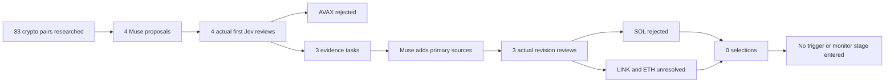

# Real Muse → first Jev crypto flow — September 20, 2026

**Outcome: four real research proposals, seven actual Jev calls, three evidence followups, zero selected trades.** SOL and AVAX were rejected; LINK and ETH remain unresolved because the final overall verdict conflicts with or outruns the evidence judgments. No order executor was connected.

At this session's start, ports8768–8770 and8780 had no listening process. The previous worker/intake could not receive reports. The current schema14 code was therefore exercised through a separate authenticated loopback API on8781 and a new private PostgreSQL ledger. It used the existing approved Jev credential loader and actual `jev-1.13.0`, without a mock provider, broker credentials, an account executor, or mutation of the owner account ledger. The temporary API and PostgreSQL process were stopped after evidence export.

## What was submitted

These are the exact conditional research levels submitted at15:18:47UTC, **not active orders or instructions to enter now**. Quotes and five-minute candles came from public Coinbase Exchange endpoints; Alpaca public quotes were retained separately. Proposed trigger, stop and target values bind to actual retained candle fields. Each item includes the latest20 completed bars plus any older level anchor, with gaps explicitly declared. Market data and sources are real; this is still an engineering research session, not strategy-performance evidence.

| Symbol | Trigger | Maximum entry | Stop | Target | Planned R at maximum, before costs |
|---|---:|---:|---:|---:|---:|
| SOL/USD |108.38|108.40|107.89|110.30|3.73|
| ETH/USD |2607.57|2610.00|2595.42|2648.55|2.64|
| LINK/USD |12.264|12.277|12.136|12.647|2.62|
| AVAX/USD |10.912|10.923|10.792|11.233|2.37|

The observed AVAX price was11.169, above the proposed entry ceiling; that proposal explicitly required a pullback and did not authorize chasing. No broker spread, liquidity, trigger or account-risk gate was claimed to have passed. The other29 researched pairs were not padded into the submission without sufficient catalyst support.

## Actual decisions and return path

| Symbol | Initial application outcome | Muse's material followup | Latest application outcome |
|---|---|---|---|
| AVAX | REJECTED; old news and high anticipation | None; no unchanged-packet reroll | REJECTED |
| SOL | NEEDS_REVIEW; pricing uncertain and economic inference questioned | Earlier V1 proposal contrasted with deployment disclosure; native SOL fee documentation and adverse cost reduction qualifications | REJECTED; new information recognized, economic inference no longer flagged, anticipation HIGH |
| LINK | NEEDS_REVIEW; freshness and anticipation unresolved | Circle's September16 disclosure establishing an earlier Chainlink infrastructure relationship; explicit distinction from Bottomline's exploratory PoC | NEEDS_REVIEW; overall APPROVE conflicts with news_stale YES and already_priced HIGH |
| ETH | NEEDS_REVIEW; provider response failed exact probability validation | Official ETH gas-payment documentation, while explicitly retaining the absence of an Ethereum-specific deployment caused by the SEC order | NEEDS_REVIEW; overall APPROVE, but news_stale YES and anticipation Insufficient evidence |

The initial SOL/LINK overall verdicts were REJECT, but uncertainty in another answer caused the existing application policy to emit NEEDS_REVIEW tasks. Those tasks are code-generated from Jev's typed answers; they are not free-form explanations of hidden reasoning. Muse claimed the three tasks over HTTP, submitted revision2, and preserved the original15:48:47UTC expiry. No risk, selection, question or probability threshold was changed.

The first ETH response was HTTP200 from the pinned model but its verdict probabilities summed to0.99, violating the existing distribution contract. Its invalid receipt remains retained. The later ETH call evaluated materially new evidence under revision2; it was not a retry of the same packet to seek a favorable vote. The six other responses passed receipt verification.

This exposes two issues for further evaluation: rounded provider probabilities can fail the current strict sum requirement, and independent Jev questions can contradict its overall verdict. This run did not relax either guard or treat an overall APPROVE as an executable selection.

## Original sources

- SOL deployment: [Solana Foundation September19 changelog](https://solana.com/news/solana-changelog-september-18-2026). Prior design: [SIMD0385](https://github.com/solana-foundation/solana-improvement-documents/blob/main/proposals/0385-transaction-v1.md), with created date2025-10-24. Economic support: [Solana fees](https://solana.com/docs/core/fees). Lower costs are an adverse qualification to a simple token-demand claim.
- ETH sector thesis: [SEC order34-106402, September17](https://www.sec.gov/files/rules/exorders/2026/34-106402.pdf); it grants conditional relief and selects no blockchain. [Ethereum gas documentation](https://ethereum.org/developers/docs/gas/) supports the ETH fee mechanism, not incremental adoption. SEC text was verified through the web PDF reader; direct download returned403, retained honestly as such.
- LINK: [Bottomline Global Pay Connect](https://www.bottomline.com/uk/payments-connectivity-financial-institutions/global-pay-connect) describes PoC exploration; publication time remains unknown. [Circle's September16 Arc announcement](https://www.circle.com/pressroom/circle-launches-arc-mainnet-an-economic-operating-system-for-the-internet) is separate prior infrastructure evidence, not proof of Bottomline production volume or LINK purchases.
- AVAX: [AvalancheGo v1.15.0](https://github.com/ava-labs/avalanchego/releases/tag/v1.15.0), published September8 at20:53:53UTC, and [Helicon schedule](https://build.avax.network/docs/primary-network/helicon-upgrade). Activation is scheduled September22,15:00UTC. No new September20 deployment or causal explanation for the rally was invented.

## Retained proof

Cycle: `5db10ab5-4850-4bc0-ae2a-cc23ff27fa9c`.

Artifacts: [run summary](../artifacts/muse-crypto-first-jev-2026-09-20/run-summary.json), [exact initial report](../artifacts/muse-crypto-first-jev-2026-09-20/report.json), [final outputs](../artifacts/muse-crypto-first-jev-2026-09-20/final-outputs.json), [provider receipts](../artifacts/muse-crypto-first-jev-2026-09-20/provider-receipts.json), and [audit checkpoint](../artifacts/muse-crypto-first-jev-2026-09-20/audit-checkpoint.json). Raw source/market responses, claim records and exact followups are retained alongside them.

Seven provider requests/receipts: six VALID, one INVALID_RESPONSE. Every call returned HTTP200 and actual model `jev-1.13.0`; observed provider latency ranged512–695ms. The independent audit verifies **139 events**, head `22606ae4c7f6358f6a79b58e8d33deffe350791fddcf49016f0c0f43600a6500`.

Managed setups, fills, risk decisions and selected events are all zero. This proves real external research intake, first-review transport, durable tasks, material followups, revision reviews and fail-closed selection. It does not establish paper execution or second-Jev monitoring acceptance because no candidate reached selection and no executor was connected.
