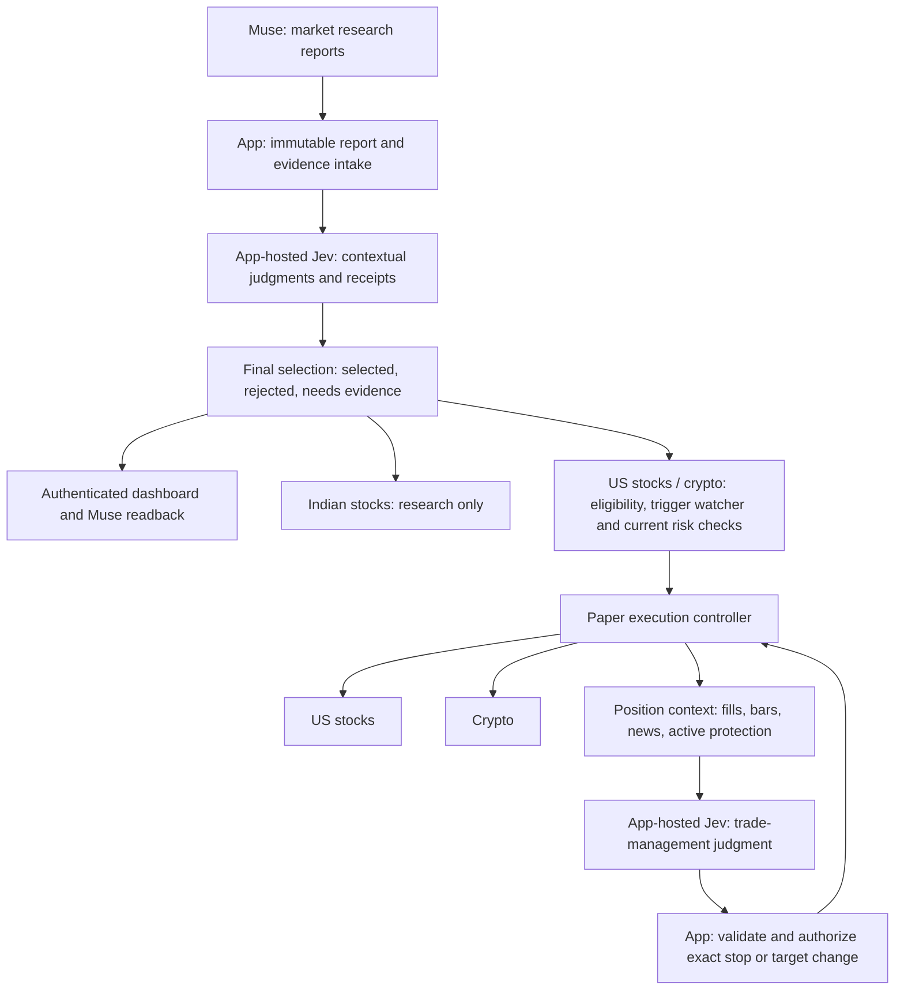

# Muse research, app-hosted Jev, paper execution

Owner direction recorded 2026-09-19. This records the requested destination and the
verified implementation boundary; it is not an execution-readiness attestation.

Current code/test evidence: [MANAGED-WIRING-2026-09-19.md](MANAGED-WIRING-2026-09-19.md).
The stock/crypto local engineering workflow now connects scanner, two Jev roles, risk,
execution, protected management and authenticated readback. Earlier gap descriptions
below preserve the original inventory. Actual Alpaca acceptance and deployment are separate.

## Owner decisions

- Muse remains the external researcher. It sends separate reports for US stocks,
  crypto and Indian stocks at different research timeframes, roughly 25–30 instruments
  per report, including source context, thesis, disproof and proposed entry/exit levels.
- Jev runs through the adapter inside the application. It reviews each report, selects
  the final list and records the judgments. Both the application and Muse can read that list.
- US stocks and crypto are intended to execute in **paper mode**. The owner
  subsequently clarified that Indian stocks stay **research-only** because Alpaca
  does not cover that market. This latest clarification supersedes the briefly requested
  all-three-market execution scope. The prior Step 4-only build limit is superseded;
  this does not attest that new execution paths exist today.
- Jev monitors open trades using news and price movement, and decides whether to
  tighten a stop or change a target. No fixed trailing formula was requested or approved.
- The app's risk/execution controller retains final authority over every order mutation.
  Local testing comes first; deployment and the real Muse connection remain deferred.
- The dashboard should be simple. Details belong behind a row or an expandable section.

## Ownership and flow

This is an application-owned review loop. Muse does not host a Python worker. Jev
is called with a supplied snapshot; it is not a background process with its own feed,
research tools or memory. The app supplies those snapshots and the scheduling/state.
Selection and trade monitoring can use the same pinned model, with different versioned
question sets and independent, durable contexts for each candidate or position.

A research selection is not a fill or a risk grant. The final list must expose both
research disposition and execution state, so Muse can distinguish SELECTED from
WATCHING, FILLED, rejected by risk, and closed. The existing public dashboard keeps
same-session picks private; current selections belong to authenticated app/Muse reads.

## Report and monitoring contracts to implement

Reports need an immutable ID, revision, market, research timeframe, structured as-of
and expiry timestamps, source references and per-instrument evidence. Preserve the
whole submitted report, including rejected/unavailable judgments. New evidence produces
new revisions. Do not adopt the previously struck two-rework-cycle cap.

App-provided position context needs the actual fill/remaining quantity, current
acknowledged stop and target, broker order IDs, position lifecycle/revision, current
quote/bar snapshot IDs, news evidence revisions, data provenance and deadline. Secrets
and account identifiers never enter Jev payloads. Times and calculations remain in code.

For management judgments, Jev chooses a typed action using the news and movement:
HOLD, TIGHTEN_STOP, ADJUST_TARGET or NEEDS_REVIEW, with an insufficient-evidence option
on every Choice. It must identify a specific proposed level through a typed, bounded
contract; a prose instruction is not an executable order. The exact source of eligible
levels is still to specify. No ATR multiplier, fixed percentage trail or confidence
threshold is invented by this document. Jev evaluates supplied evidence/options; code
computes price geometry, rounding, risk and validity.

A management decision binds to one open position revision, evidence revision and
acknowledged order state, with an expiry and idempotency key. The controller must reject
obsolete decisions, widened stops, increased quantity/risk, changes after a mechanical
exit, or attempts to postpone the mandatory risk/session exit. A target change does not
imply extending a holding deadline. Jev outages leave mechanical protection running.

Every accepted broker amendment needs an exact risk-decision row and an audit trail.
Handle partial fills, pending replacement, timeout, late fills and both exit legs filling
before enabling amendments. Unresolved order state blocks further model-driven changes;
the existing protective recovery controller remains responsible. Do not use a destructive
cancel-then-replace sequence that leaves filled inventory unprotected.

These requirements permit contextual Jev decisions. They do not promise improved profit.

## Market execution boundaries

| Market | Intended execution | Current state / required work |
| --- | --- | --- |
| US stocks | Alpaca Paper | Existing V1 risk-gated execution machinery; production validation evidence and nominal controlled acceptance still incomplete. Jev entry and management integration not enabled. |
| Crypto | Alpaca Paper | Separate adapter/controller needed. Broker supports market, limit and stop-limit crypto orders with GTC/IOC; do not copy the stock DAY bracket. Quantity increments, protection, expiry/session policy and shared account risk need explicit support and tests. |
| Indian stocks | Research only | Muse reports and Jev judgments can be displayed/read back, but no order adapter, execution intent consumer or paper fill is enabled for India. Manual/research INR results remain separately labeled. |

Alpaca source checked 2026-09-19:
[crypto orders](https://docs.alpaca.markets/us/docs/crypto-orders) and
[order API reference](https://docs.alpaca.markets/us/v1.1/reference/postorder).
The latter lists crypto order class as simple, not bracket.
For stock protection, Alpaca documents full-parent-fill activation, replacement support
and the possibility of both exits filling before cancellation:
[order handling](https://docs.alpaca.markets/us/docs/orders-at-alpaca).

Unknown broker exposure must still halt reconciliation. Adding crypto must not disable
that guard: the combined US/crypto account and working orders need one atomic risk view.
There is no implicit separate 2% allowance for each asset class sharing the same equity.
Do not invent a crypto daily reset or quantity policy to satisfy a test. Missing crypto
policy/data blocks crypto execution. India has no execution path; its research currency
and timestamps remain explicit and never enter the US/crypto account-risk budget.

## Attribution

The frozen `CATALYST_RETEST_V1` entry mechanics and baseline fixed exits remain intact.
The owner-authorized managed-exit build requires a separate exit policy and cohort;
proposed identifiers are `JEV_MANAGED_EXITS_V1` and `JEV_MANAGED_PAPER_V1`. They are
**reserved design names, not enabled database/config values**. There is no V2 strategy.

Each future execution must carry market, execution source, strategy version, research
policy, exit policy, pinned model/question set, and cohort at its authorizing transaction.
An old baseline trade cannot acquire the managed cohort because it later gets a review.
Engineering tests, manual research, app simulations and broker paper results stay distinct.
USD and INR are not added into a combined headline return. Existing `JEV_ACTIVE_V1`
review records remain review records and do not prove execution integration.

## Current implementation checkpoint

Implemented before this direction: pinned real Jev adapter and immutable receipts;
Step 4 evidence/context storage and inert intents tested in disposable PostgreSQL.
The subsequent local report milestone implements report-batch selection and authenticated
API readback; see RESEARCH-REPORT-SELECTION.md. A separate app-owned research worker and authenticated shortlist now exist; see
REVIEW-WORKER-LOCAL.md. No recurring Jev position monitor, multi-market execution or
stop/target amendment path exists yet.

Implemented in this turn: a smaller read-only dashboard, four primary metrics,
US stocks/Crypto/Indian stocks navigation, expandable detailed stats and audit notes,
existing record detail/CSV and public disclosure gates preserved. The crypto tab truthfully states that paper execution is not connected. The India tab
states that it is research-only by owner decision. No synthetic
picks, positions or performance were inserted to decorate the interface.

Next build order:
1. Immutable three-market report intake, per-item Jev reviews and authenticated selection readback.
2. App worker/context/event persistence, deadlines, receipt verification and restart tests.
3. US Jev entry integration with fresh risk/trigger checks and separate cohort attribution.
4. Tested position-management intents and authorized broker amendment/recovery path.
5. Crypto policy/adapter and isolated paper proving runs; India remains research-only.
6. Private live shortlist/positions UI, then deployment and Muse connection after local acceptance.

This sequence describes remaining work, not a running automation. No recurring build or
trading schedule was enabled by writing this document.

Detailed implementation stages, test gates and unresolved policy inputs are in
[TEST-READINESS-PLAN.md](TEST-READINESS-PLAN.md).

## Selection rules: V2 by default, B1 in shadow, owner activation (2026-09-24)

The rule text, vetoes, floor and provenance are recorded in
[CONTRACT-RESOLUTIONS.md](CONTRACT-RESOLUTIONS.md) under
`MUSE_JEV_RESEARCH_SELECTION_B1_V1`. In short: `MUSE_JEV_RESEARCH_SELECTION_V2` (verdict APPROVE
plus the three component answers) remains the default; B1 lets the three component answers decide
and records the verdict as `dissent`, and when active adds the owner's QUALITY floor, a category
check on a `MUSE_JEV_COMPARATIVE_QUALITY_V2` judgment.

What runs without any owner action: every selection decision also appends one
`RESEARCH_SHADOW_DISPOSITION` event with B1's disposition, reasons and dissent for that receipt
chain. These events are never selected or admitted and make no extra provider call.

Owner steps, in order:

1. **Replay (read-only).** On a ledger at schema 18 or later (V2 receipts from schema 20):
   `./run python scripts/replay_selection_policy.py --database-url "<DSN as catalyst_review>"`.
   The script refuses `catalyst_app`, `catalyst_risk`, `lab_owner` and every other role, opens a
   read-only session and reads only the `lab.selection_replay_*` views, which carry no
   `request_json` (no evidence text). For an archived ledger that predates the views, print the
   export query with `--print-export-sql`, run it yourself read-only (for example
   `PGOPTIONS='-c default_transaction_read_only=on' psql -qAtX -f query.sql > export.json`)
   and replay the saved JSON with `--export export.json`. `--dump-fixture PATH`
   writes a LAB_FIXTURE export from a disposable ledger to show the format. Output: per item the
   V2 disposition, the B1 disposition and reasons, the dissent verdict and the QUALITY_V2
   category if any; totals of what V2 and B1 would select, with and without each floor, and which
   items. SKEPTIC requests that name no research item (engineering probes, proofs) are counted
   and skipped. Codes, identifiers and counts only. Not applied offline: the per-cycle limit, expiry
   and supersession, eligibility, reward/risk, risk limits and the database audit chain.
2. **Optional real shadow cycles.** The plan leaves the number of real shadow cycles before
   activation to the owner; their `RESEARCH_SHADOW_DISPOSITION` events accrue on their own.
   Shadow cycles have no QUALITY_V2 judgments, so the replay's "with floor" totals count only
   cycles that ran with B1 active.
3. **Activation.** Set `MANAGED_SELECTION_RULE=MUSE_JEV_RESEARCH_SELECTION_B1_V1` and
   `MANAGED_SELECTION_QUALITY_FLOOR` to `WEAK`, `ADEQUATE` or `STRONG`, then restart the runtime.
   Startup records `RESEARCH_SELECTION_RULE_ACTIVATED`; cycles started from then on are B1
   cycles for their whole life. Reverting the key to V2 (or removing it) affects new cycles
   only. The launcher's private-config allowlist (`managed_ops.ENV_NAMES`) must carry both keys
   before they can be set through it; without them the runtime stays on V2.

Selection rule B2 (`MUSE_JEV_RESEARCH_SELECTION_B2_V1`, 2026-09-25, schema 20) is a third
option under the same switch: `MANAGED_SELECTION_RULE=MUSE_JEV_RESEARCH_SELECTION_B2_V1` with a
floor. It reviews with `SKEPTIC_QUESTIONS_V2` (no `unsupported_inference`; two mechanism
questions and a factual-claims check), keeps B1's shape (components decide, verdict as dissent,
QUALITY floor) and needs the agent's rationale. Its definition and provenance are in
CONTRACT-RESOLUTIONS.md. B2 cannot be replayed over the retained ledgers: their receipts answer
V1, so the replay reports `REPLAY_NOT_APPLICABLE_QUESTION_SET` for B2 there rather than inventing a
disposition; B2 replays only over V2 receipts, which exist once B2 has run (a supervised
session with `--selection-rule B2` is the first place). The real-provider evidence for the
question set is `artifacts/jev-rule-experiment-2026-09-25/`. Activation, the activation event
and the cycle-life rule are B1's; there is no B2 shadow over V1 cycles.

Export format `CATALYST_SELECTION_REPLAY_EXPORT_V1`: one JSON object with `jev_requests`
(`request_id`, `evidence_identity`, `stage`, `question_set_version`, `template_hash`),
`jev_receipts` (`receipt_id`, `request_id`, `attempt`, `outcome`, `http_status`, `error_code`,
`actual_model`, `response_hash`, `response_bytes_base64`) and `ai_decisions` (`decision_id`,
`receipt_id`, `question`, `answer_json`), limited to the SKEPTIC and comparative-QUALITY question
sets. The replay checks each response's hash and projected judgments against its bytes.
